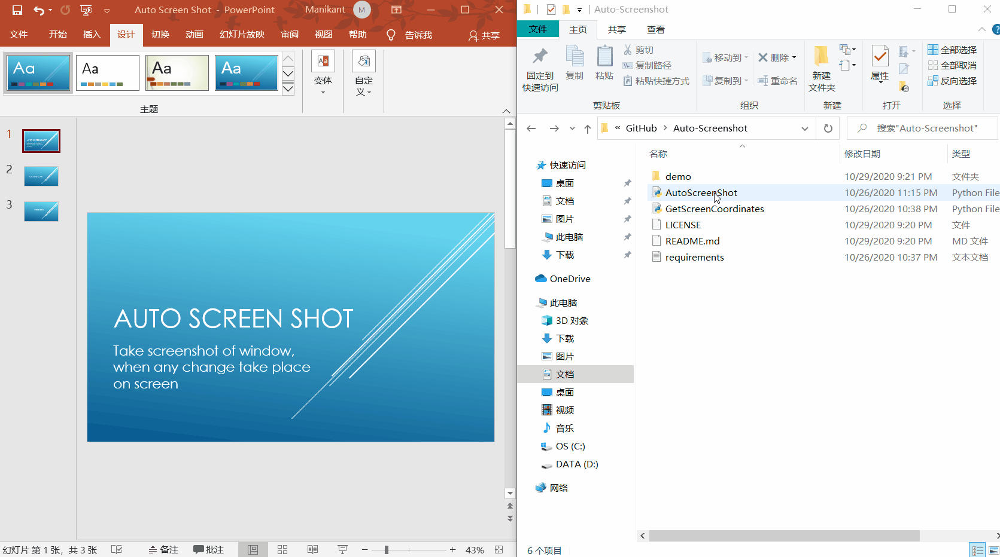

# Auto-Screenshot
Take screenshot of part of screen, when there are differences or some changes in some other screen automatically.

It shall help when taking class online and need to take screenshot of every slides in ppt. (Note: When ppt not shared or available)

This version allows monitoring of only part of the screen, useful if e.g. the Zoom presenter is covering part of the powerpoint.

# How to use
1. Install Python
2. Install following python modules
```
pyqt5
pyscreenshot
pillow
imgcompare
```
It can also install by running following in terminal.
```
pip install -r requirements.txt
```
3. Run ```AutoScreenshot.py``` via terminal
4. Click ```Select Area to Monitor``` and draw rectangular part on screen where you want to monitor changes.
4. Click ```Start``` and draw rectangular part on screen where you want to screenshot.
5. Now it shall take screenshot when the monitoring area changes automatically.
6. Close the program when not needed

# Notes

Image comparison algorithm uses the imgcompare library. The default tolerance value is set to 5.0, you can set it by editing the code.

<!--
# Demo

-->

# License
MIT License

